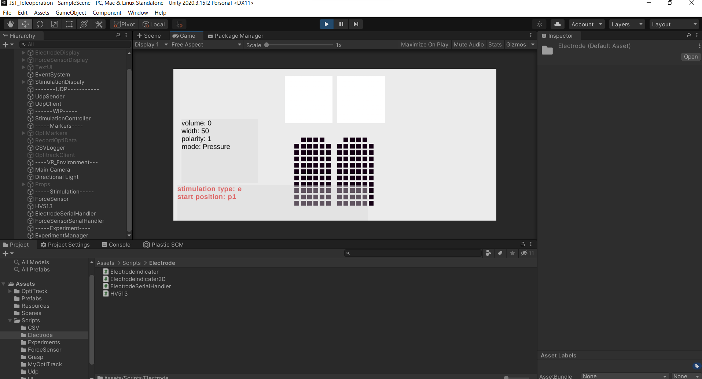

# Unity project of JST Teleoperation project

触覚センサと電気刺激の統合をするためのUnityプロジェクトです。
大きいAssetを使ってないので、Githubを使ってみています (大きいファイルが入る場合は、Githubは使わない方がいいかもです)。

Unityを使っている理由はOptiTrackを使っていた (現在はUnityでOptiTrackを利用していない) 名残とフレームレートを管理しやすいからです。Threadを分けたりすれば、100 ~ 1000 Hz当たりを調整できると思います。

Google Documentもあるので、そちらも参照してもらえるといいかもです。
https://docs.google.com/document/d/1qdfT964ux319iSeuI-L4a03TI0xT5Vrt_tPS17ZRg2U/edit?usp=sharing
(このリポジトリがどこまで公開されるか把握してないので、とりあえず閲覧者モードにしてます)

## 使うときの注意

### 電気刺激のキャリブレーション

- 今は、12bit 使用し、4095段階で調整できるようにしています
- 矢印キーの上下は50ずつ、`h`と`j`で10ずつ変更するようにしています
- `m` で刺激モードが切り替わり、`pressure` が触覚センサのデータを使うモードです。
  - `vibration` は触覚センサのデータを基に振動子に入力するPWMのduty比をESPに送信するモードです。
  - 振動子の強度決定については、記載していませんが、必要であれば追記します。

### 触覚センサのオフセット

- 実行してから3秒経ったら、その時の触覚センサの値をオフセットとして記録する処理が書いてあります。この時に触ってるとおかしくなってしまうので、注意です。
- コメントアウトした方がいいかもです (↓のForceSensor.csの中にあります)

### キーマッピング

- `HV513.cs` と `ExperimentManager.cs` でキー入力に対する処理が書いてあります。
- `HV513.cs` は基本的に電気刺激のパラメータや刺激モードを切り替えるためのもので、`ExperimentManager.cs` は文字通り実験の進行に使っていたものです。
  - `ExperimentManager.cs` はあまり使う場面はないですが、`o` を押すと触覚センサのオフセットを更新し、`e` を押すと刺激のON/OFFを切り替える処理が書いてあります。

## ESP32 プログラム

`Arduino/` 以下に入れちゃいました。
`HV513_128chTest20210903` が電気刺激用で、`Measurement10x10_3FingersMultiTask12bit20200326` が触覚センサ用です。
詳しくは、梶本先生のGrowi解説記事を読むのが分かりやすいです (大きな変更はしてないので！)。

- 電気刺激について: https://kaji-lab.growi.cloud/user/kajimoto/%E3%83%A1%E3%83%A2/2020/11/04/%E9%9B%BB%E6%B0%97%E5%88%BA%E6%BF%80%E8%A3%85%E7%BD%AEUSB%E3%83%90%E3%82%B9%E3%83%91%E3%83%AF%E3%83%BC%E7%89%88%E3%83%9E%E3%83%8B%E3%83%A5%E3%82%A2%E3%83%AB
- 触覚センサ: https://kaji-lab.growi.cloud/user/kajimoto/%E3%83%A1%E3%83%A2/2020/03/17/%E3%83%A1%E3%82%AF%E3%83%88%E3%83%AD%E3%83%B3%E8%A7%A6%E8%A6%9A%E3%82%BB%E3%83%B3%E3%82%B5%E3%82%B0%E3%83%AD%E3%83%BC%E3%83%96
  - slack の teleoperation チャンネルに、開発ノート powerpoint も共有してくれているので、そちらも見ると理解が深まりそうです

### 電気刺激の強度

- 刺激するか・どうか？の確率を変えることで、疑似的に強度を変えようとしています
- 現状は 3段階で、Unityから 4bit を使って指定います。
- この値やレンジは、牛山が結構おおざっぱに決めたもので、あまりダイナミックレンジが大きくない (触覚センサを押す強度を変えても、圧力の強弱ががそんなに分からない) ので、要修正です。
  - 面積が変わる方が分かりやすいですが、例えば鉛筆の先端で押す強さを変えたときの圧力変化とかは、現状では分からないです。

## Unity プログラムについて

触覚センサと電気刺激とのシリアル通信がメインなので、まずはどう実装しているのか記載します。
基本的な触覚センサから電気刺激へのデータ変換はGoogle Documentに以前書いたものとかわっていないです。
(コードは少し変わってるかもですが)

コード自体もできるだけ、コメントを書くように心がけたつもりですが、分かりづらいところは聞いてもらえると嬉しいです
(もしくは、自分で書いちゃった方が早いかもです)

### 触覚センサ

- Assets/Scripts/ForceSensor 以下のファイルです
- `ForceSensorSerialHandler.cs`
  - ESP32とのシリアル通信を担っています
  - Google Document が詳しいです

- `ForceSensor.cs` 
  - 触覚センサのデータを処理するためのクラスです
  - シリアルデータを受け取った後の処理が書いてある（はず）
  - :warning: Offset 処理を実装しています
  - グリッパーに触覚センサを張り付けていると、デフォルトで触覚センサが反応してしまっていることがあります。このままだと、常に電気刺激が提示されてしまうので、その値をオフセットとして保存する処理を実装しています。
  - `public void SaveDistributionAsOffset()` : 現在の pressureDistribution を オフセット配列として保存
  - `IEnumerator OffsetProcess()`: 実行開始 3秒後にオフセットを自動でかけるようにしています (なので、この時に触っていると、オフセットがおかしくなる可能性があります)
    - 間違ったオフセットが保存されてしまった場合は、`o` を押すとオフセットをupdateできます
    - これは `ExperimentManager.cs` に実装してあります。

- `ForceSensorIndicator2D.cs`
  - これはUnity画面に触覚センサのデータを描画するために使われます
  - 結構力技です

### 電気刺激

- Assets/Scripts/Electrode 以下のファイルです
- `ElectrodeSerialHandler.cs`
  - 電気刺激装置にシリアル通信で指令を送るためのクラスです
  - Google Document が詳しいです
- `HV513.cs`
  - 電気刺激と振動提示の制御を担当しているクラスです
    - 同じ ESP基板で振動も提示するので、ここに振動提示も実装しました
  - `void Stimulation()` が刺激をするためのメソッドで、`Start()` で別スレッドで起動しています
  - `System.Threading.Thread.Sleep(10);` でフレームレートの管理をしています
    - ms 単位なので、10ms sleepするという意味になります。100 Hz
    - ただ現状の電気刺激プログラムはESP32が刺激周波数を決めているので、ここの周波数は、刺激パラメータを変更した時にどれだけ早く変更が反映されるか？ぐらいのものだと思っています
    - 触覚センサが150~200Hz程度なので、そこまで早くしても意味はないかなと思います。
    - *ESPのプログラムを修正せずに*早くしすぎると (例えば 1kHz) 、うまく電気刺激できなくなります
-  `ElectrodeIndicator2D.cs`
   -  電極の刺激点をUnity上で表示するために利用されます
   -  結構力技です。
-  